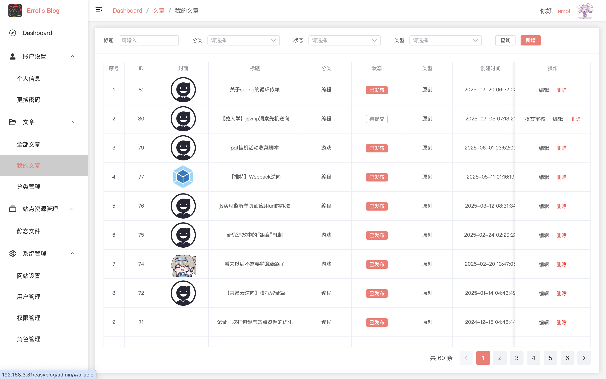
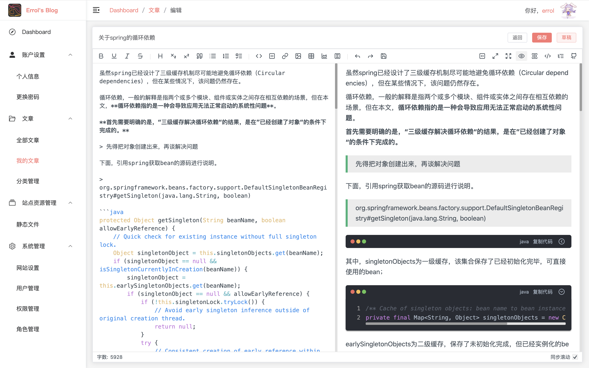

# easyblog-admin-vue3

基于vue的简易博客后台管理，包含了文章管理、文章分类管理、权限管理、角色管理等功能。

<del>(正在将项目从vue2转vue3，痛苦面具中...)</del>

现已完工。



图1 文章管理



图2 编辑文章

两张图其实已经把系统的主要功能讲完了，其他像是权限、角色、用户之类的模块确实有，但也只是象征性地加了一下，大多数情况下，只是个人使用的博客系统。同时，还整合了一个可用性不是很高的[oauth2授权系统](https://github.com/errr0l/your-approval)。

本系统需要一个外部配置文件，来提供像是项目前缀、oauth2回调地址、debug开关（设置为true时，可获得更多的相关信息）这样的参数，默认的请求地址为/easyblog/config.json，可参照根目录nginx.conf文件进行配置。

本意是觉得通过外部配置对系统进行微调，有时候比较方便，而不是每次都要重新构建代码，如修改接口地址这个比较典型的场景。

```json
{
    "PREFIX": "/easyblog/admin",
    "OAUTH": {
        "OAUTH_REDIRECT_URI": "http://localhost:5173/#/oauth2/callback",
        "OAUTH_AUTHORIZATION_URI": "http://localhost:8111/oauth2/authorize",
        "OAUTH_CLIENT_ID": "1"
    },
    "DEBUG": true
}
```

后续可能还会加一些跟部署相关的功能，如在在管理系统初始化服务器git仓库之类的（即静态文件输出目录）。

### 更新日志

#### 1、202509

1）新增了创建、刷新资源文件的功能